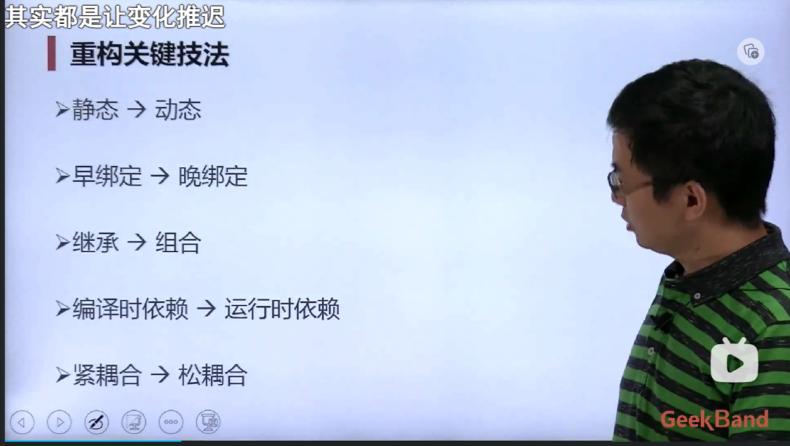
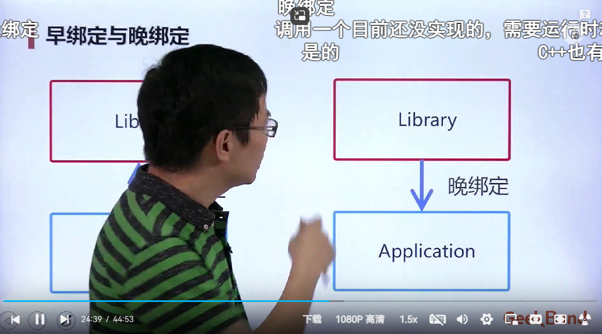

B站课程，基于C++，<C++设计模式入门>

> https://www.bilibili.com/video/BV1Yr4y157Ci/?p=3&spm_id_from=pageDriver&vd_source=5dfea5026d075d931fad105f6420b546

# P3 模板方法

基类要写析构函数，并且要写成虚函数

模板方法：

    父类和子类各自实现一部分功能，父类中使用虚函数，在子类中实现

    虚函数的实质就是函数指针
